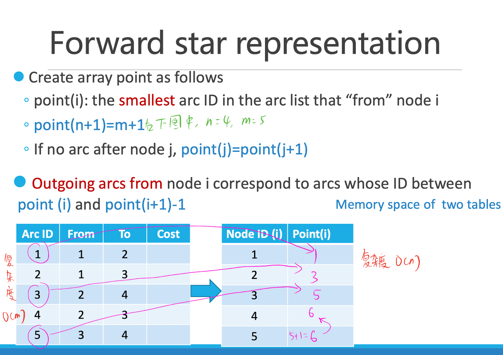
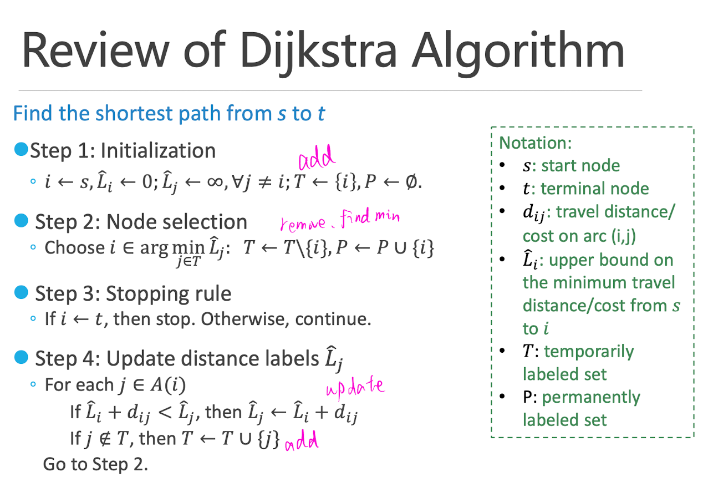
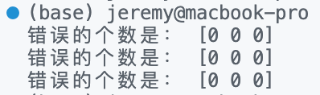

# Dijkstra 算法求解最短路径问题

本文使用 Python 实现了 Dijkstra 算法求解最短路径问题。在算法实现中，使用数组存储网络中各结点之间的距离，使用二叉堆存储T集合，并尽量使用向量化计算加快运行速度。

最终在三种网络结构下的运行时间为：

| 输入文件 | grid_150_150 | random_20000_40000 | dense_1000 |
| -------- | ------------ | ------------------ | ---------- |
| 运行时间 | 302.93ms     | 292.14ms           | 135.29ms   |

但在最开始实现 Dijkstra 算法时，我的程序需要花 5 秒才能完成计算。经过逐步优化，运行时间可以降为 3 秒甚至 0.13 秒。把算法效率优化到极致的过程是非常有收获的，既加深了对算法本身的理解，又学习了许多优化算法的经验。

!!! tip "优化算法的经验"

	1. 向量化计算，尽量避免使用 for 循环。
	2. 想清楚算法的终止条件是什么。例如，在 One-to-all 问题中，可以把“遍历完T集合中的所有元素，直到T集合为空集”作为终止条件，也可以把“P集合中的元素个数等于网络中的结点个数”作为终止条件。虽然两者都能得到正确的结果，但当P集合中的元素个数等于网络中的结点个数时，T集合中的元素是不需要再更新的，所以后者比前者所需要的运算次数少得多。
	3. 熟悉 `NumPy` 等科学计算库的实现细节。例如，在 `NumPy` 中，`np.ones` 和 `np.empty` 都可以用来创建指定形状的数组，其中 `np.ones` 会创建一个填充 1 的数组，而 `np.empty` 会在一块内存上创建一个未初始化的数组。由于 `np.empty` 不会进行初始化，因此生成速度要比 np.ones 更快。


<!-- more -->

## 导入包

```python
import heapq
import numpy as np
import argparse
import time
```

## 实现Dijkstra 算法





### 使用的数据结构

1. Forward star representation：使用 `NumPy` 中的二维数组存储网络中各结点之间的距离，使用 `NumPy` 中的一维数组存储Point数组。
2. 输出结果：使用 `NumPy` 中的二维数组存储起始点到各点的距离。
3. T集合：本质为 `list` 的二叉堆，使用Python内置标准库 `heapq` 实现添加、删除、提取最小元素等操作。
4. P集合：Python 内置的 `set` 结构。

```python
def solve(args):
    start_time = time.time()
    # 网络类型
    network_type = args.network_type
    # 读取结点数量 n 和边的数量 m
    with open(args.network_file, "r") as f:
        n = int(f.readline().split("=")[1].strip())
        m = int(f.readline().split("=")[1].strip())
    # 读取起始点
    with open(args.origin_file, "r") as f:
        # 跳过第一行
        f.readline()
        origin = int(f.readline().strip())
    # 读取网络文件中的 Forward star representation
    network = np.loadtxt(
        args.network_file,
        skiprows=3,
        delimiter=",",
        dtype=np.int32,
    )
    # 提取所有的 node id
    node_id = np.unique(network[:, 0:2])
    # 按照 network 中的第一列排序，得到 network
    network = network[network[:, 0].argsort()]
    # 定义 point 数组，表示每个 node 在 network from 中首次出现的索引
    point = np.empty(n + 1, dtype=np.int32)
    point[:-1] = np.searchsorted(network[:, 0], node_id)
    point[-1] = m
    # 初始化
    i = origin
    # 最终输出结果，为一个 n * 3 的矩阵，三列分别为：起始点编号，终止点编号，最短路径
    output = np.empty((n, 3), dtype=np.int32)  # 创建一个 n*3 的矩阵
    output[:, 0] = origin  # 将第一列的所有元素设置为 origin
    output[:, 1] = np.arange(1, n + 1)  # 将第二列的所有元素设置为 range(1, n+1)
    output[:, 2] = np.iinfo(np.int32).max  # 将第三列的所有元素设置为 int32 的最大值
    output[i - 1, 2] = 0  # 将第 origin 到 origin 的距离设置为 0
    # Temporarily labeled set，用小顶堆实现
    t = [(0, i)]  # 将 (0, i) 放入小顶堆中
    t_set = set([i])  # 创建一个集合，包含 t 中的 node
    # Permanently labeled set
    p = set()  # 创建一个空集合
    # 对于 one-to-all 问题，当 Permanently labeled set 中的元素个数等于 n 时，结束循环
    while len(p) != n:
        # Node selection
        # 从 t 中取出最小的元素
        d_i, i = heapq.heappop(t)
        # 将 i 从 t_set 中移除
        t_set.remove(i)
        # 将 i 加入到 p 中
        p.add(i)
        # 从 network 中取出 i 的邻接点
        start_point = point[i - 1]
        end_point = point[i]
        # 提取 i 的所有邻接点 j_s
        j_s = network[start_point:end_point, 1]
        # 提取 i 到 所有邻接点 j_s 的距离
        d_ij_s = network[start_point:end_point, 2]
        # 判断 d_i + d_ij_s 是否小于当前的最短距离，若是则需要更新它们的最短距离
        is_less = d_i + d_ij_s < output[j_s - 1, 2]
        # 判断 j_s[less] 中的元素是否在 t_set 中
        is_in_t_set = list(map(lambda x: x in t_set, j_s[is_less]))
        # 如果 j_s[less] 中的元素不在 t_set 中，则将 j 加入到 t_set 中
        t_set.update(j_s[is_less][list(map(lambda x: not x, is_in_t_set))])
        # 如果 j_s[less] 中的元素在 t_set 中，则将原有的 (d_j, j) 移除
        for j in j_s[is_less][is_in_t_set]:
            t.remove((output[j - 1, 2], j))
        # 更新 j 的最短距离：d_j = min(d_j, d_i+d_ij)
        output[(j_s - 1)[is_less], 2] = d_i + d_ij_s[is_less]
        # 将所有 j_s[is_less] 的元素及其最短距离加入到 t 中
        for j in j_s[is_less]:
            heapq.heappush(t, (output[j - 1, 2], j))
    end_time = time.time()
    # 将结果导出到 22210690089_output_{args.network_type}.txt
    np.savetxt(
        f"22210690089_output_{args.network_type}.txt",
        output,
        fmt="%d",
        delimiter=",",
        header="origin,destination,distance",
        comments="",
    )
    # 将运行时间导出到 22210690089_time_{args.network_type}.txt
    with open(f"22210690089_time_{args.network_type}.txt", "w") as f:
        f.write(f"{(end_time - start_time) * 1000:.2f}ms")
```

## 接收命令行参数，运行主程序

```python
if __name__ == "__main__":
    parser = argparse.ArgumentParser("22210690089")
    parser.add_argument(
        "network_type",
        type=str,
        default="grid",
        choices=[
            "grid",
            "random",
            "dense",
        ],
    )
    parser.add_argument(
        "network_file",
        type=str,
        default="grid_150_150.txt",
    )
    parser.add_argument(
        "origin_file",
        type=str,
        default="origin_grid_150_150.txt",
    )
    args = parser.parse_args()
    solve(args)
```

## 检验正确性

```python
import numpy as np

for network_file in [
    "grid_150_150.txt",
    "random_20000_40000.txt",
    "dense_1000.txt",
]:
    my_output = np.loadtxt(
        f"22210690089_output_{network_file.split('_')[0]}.txt",
        skiprows=1,
        delimiter=",",
        dtype=np.int32,
    )
    correct_output = np.loadtxt(
        f"答案_Output_{network_file}",
        skiprows=1,
        delimiter=",",
        dtype=np.int32,
    )
    print("错误的个数是：", sum((my_output != correct_output)))
```

测试样例全部计算正确：


